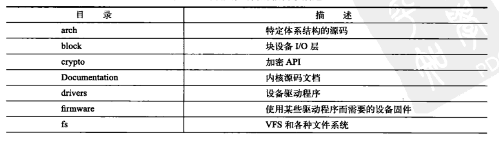
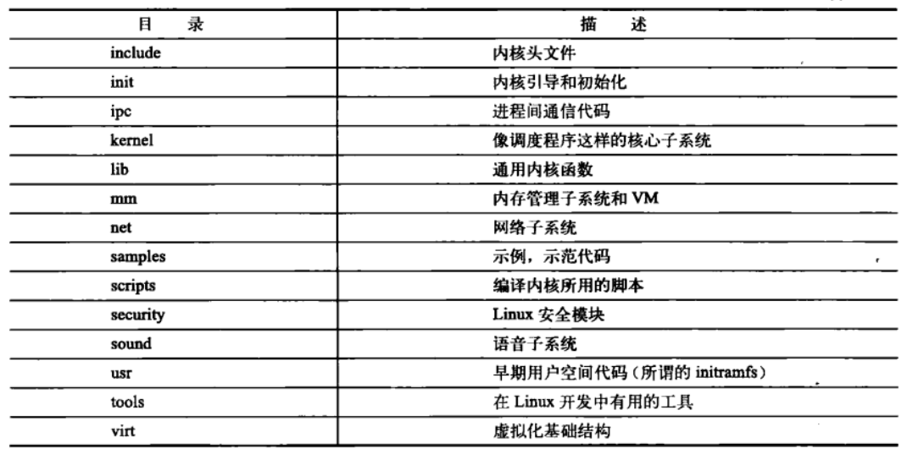

# 从内核出发

## 解压文件

tar xvjf linux-x.y.z.tar.bz2

tar xvzf linux-x.y.z.tar.gz

## 补丁

patch -p1 < ../patch-x.y.z

## 内核源码树（根目录描述）

## 编译内核

内核文件一般放置于/home/pi/目录下

图形化界面配置：make menuconfig

编译：make

​	或者以多个作业编译内核：make -j4

安装模块：make modules_install

安装：make install

对于开发板，将vmlinuz、initrd、开发板设备树文件拷贝至/boot/firmware/下，reboot后查看内核版本是否变化。
