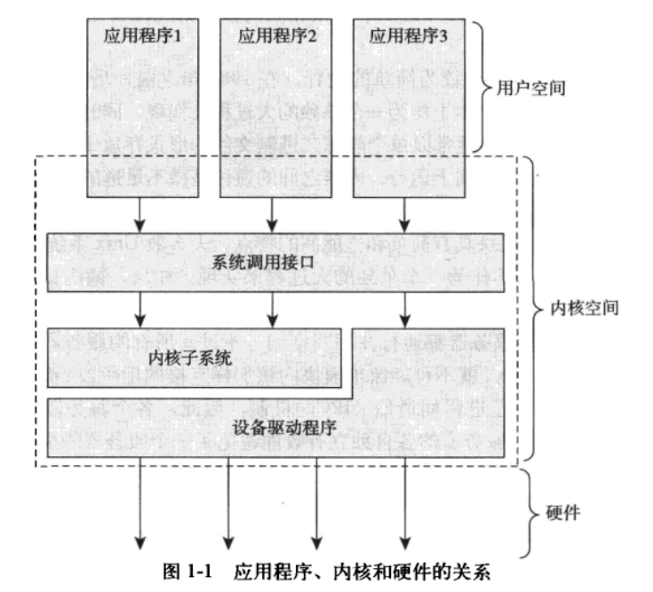

# Linux内核简介

​	对于提供保护机制的现代系统来说，内核独立于普通应用程序，它一般处于系统态，拥有受保护的内存空间和访问硬件设备的所有权限。这种系统态和被保护起来的内存空间，统称为内核空间。相对的，应用程序在用户空间执行。它们只能看到允许它们使用的部分系统资源，并且只使用某些特定的系统功能，不能直接访问硬件，也不能访问内核划给别人的内存范围，还有其他一些使用限制。当内核运行的时候，系统以内核态进入内核空间执行。而执行一个普通用户程序时，系统将以用户态进入以用户空间执行。

​	在系统中运行的应用程序通过系统调用来与内核通信(见图 1-1)。应用程序通常调用库函数（比如 C 库函数）再由库函数通过系统调用界面，让内核代其完成各种不同任务。

​	当一个应用程序执行一条系统调用，我们说内核正在代其执行。如果进一步解释，在这种情况下，应用程序被称为通过系统调用在内核空间运行，而内核被称为运行于进程上下文中。这种交互关系一一应用程序通过系统调用陷入内核一一是应用程序完成其工作的基本行为方式。

